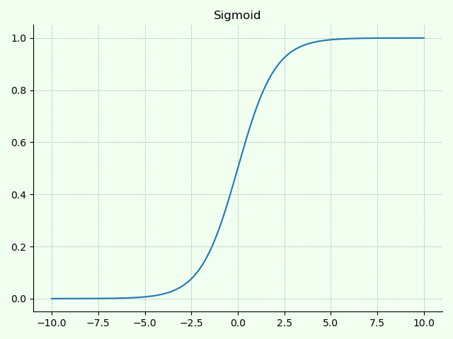

激活函数在深度学习领域经常被使用到，使用合理的激活函数，不仅可以加速模型的收敛（因为输入范围可以被激活函数缩小），而且也有助于对最后输出结果的判别。

本文主要对在深度学习中常用的激活函数进行简要介绍

## 基本概念

**激活函数**的本质操作是将神经元输出的结果通过函数映射在指定的范围内，也就是说，**为模型引入非线性因素，弥补模型的表达能力**。合理的使用不同类型的激活函数，不仅可以提升模型的非线性能力，而且对于提升模型鲁棒性，缓解梯度消失和加速模型收敛都有所帮助。

根据激活函数的导数性质，可以将激活函数分为**饱和激活函数（Saturated Neurons）**和**非饱和激活函数（Non-Saturated Neurons）**。

- **饱和激活函数**
假设 $h(x)$ 是一个激活函数
  - **左饱和**：当 $x$ 趋近于负无穷，激活函数导数趋近于 0 ，则该函数为左饱和。
  $$\lim_{x\to -\infty}h'(x)=0$$
  - **右饱和**：当 $x$ 趋近于正无穷，激活函数导数趋近于 0 ，则该函数为右饱和。
  $$\lim_{x\to +\infty}h'(x)=0$$
  - 当一个函数既满足左饱和又满足右饱和，则称之为饱和激活函数。

- **非饱和激活函数**：不满足饱和激活函数条件的函数。
  - 使用非饱和激活函数的优势在于：**可以解决梯度消失问题同时加速收敛**

## Sigmoid

`Sigmoid` 激活函数是一种在机器学习和深度学习中都广泛应用的一种最常用的激活函数，也是一种饱和激活函数，

+ 公式：
$$\sigma = \frac{1}{1+e^{-x}}$$
$$\sigma '= \frac{e^{-x}}{(1+e^{-x})^2}=\sigma (1-\sigma )$$

+ 图示：


+ 值域：$[0,1]$

+ 特性：
  - 函数导数在 $x=0$ 时取得最大值 $1/4$
  - **优点**：
    - 输出范围是 0 到 1，可以自动归一化（因此经常用于模型最后的输出层）
    - 函数全程可微
  - **缺点**：
    - 极容易梯度消失。假设输出值特别大或特别小，激活函数梯度约为 0，会导致无法得到有效更新。
    - 输出并不是以 0 为中心的。这会导致后一层神经元将上一层非零值作为输入信号，使得对参数的更新全部向一个方向更新，使得训练收敛缓慢。（但是如果多 batch 训练，因为不同 batch 可能得到不同的信号，因此可以对该问题有所缓解。）
    - 计算耗时。因为含有幂次运算。

## TanH
`TanH` 激活函数是一种在 `Sigmoid` 基础上改进的函数，解决了 `Sigmoid` 函数不以 0 为中心的输出问题，也是一种饱和激活函数。全称：双曲正切函数。

+ 公式：
$$\sigma = \frac{1}{1+e^{-x}}$$
$$\sigma '= \frac{e^{-x}}{(1+e^{-x})^2}=\sigma (1-\sigma )$$

+ 图示：


+ 值域：$[0,1]$

+ 特性：
  - 函数导数在 $x=0$ 时取得最大值 $1/4$
  - **优点**：
    - 输出范围是 0 到 1，可以自动归一化（因此经常用于模型最后的输出层）
    - 函数全程可微
  - **缺点**：
    - 极容易梯度消失。假设输出值特别大或特别小，激活函数梯度约为 0，会导致无法得到有效更新。
    - 输出并不是以 0 为中心的。这会导致后一层神经元将上一层非零值作为输入信号，使得对参数的更新全部向一个方向更新，使得训练收敛缓慢。（但是如果多 batch 训练，因为不同 batch 可能得到不同的信号，因此可以对该问题有所缓解。）
    - 计算耗时。因为含有幂次运算。

## ReLU
`Sigmoid` 激活函数是一种在机器学习和深度学习中都广泛应用的一种最常用的激活函数，也是一种饱和激活函数，

+ 公式：
$$\sigma = \frac{1}{1+e^{-x}}$$
$$\sigma '= \frac{e^{-x}}{(1+e^{-x})^2}=\sigma (1-\sigma )$$

+ 图示：


+ 值域：$[0,1]$

+ 特性：
  - 函数导数在 $x=0$ 时取得最大值 $1/4$
  - **优点**：
    - 输出范围是 0 到 1，可以自动归一化（因此经常用于模型最后的输出层）
    - 函数全程可微
  - **缺点**：
    - 极容易梯度消失。假设输出值特别大或特别小，激活函数梯度约为 0，会导致无法得到有效更新。
    - 输出并不是以 0 为中心的。这会导致后一层神经元将上一层非零值作为输入信号，使得对参数的更新全部向一个方向更新，使得训练收敛缓慢。（但是如果多 batch 训练，因为不同 batch 可能得到不同的信号，因此可以对该问题有所缓解。）
    - 计算耗时。因为含有幂次运算。

## ELU
`Sigmoid` 激活函数是一种在机器学习和深度学习中都广泛应用的一种最常用的激活函数，也是一种饱和激活函数，

+ 公式：
$$\sigma = \frac{1}{1+e^{-x}}$$
$$\sigma '= \frac{e^{-x}}{(1+e^{-x})^2}=\sigma (1-\sigma )$$

+ 图示：


+ 值域：$[0,1]$

+ 特性：
  - 函数导数在 $x=0$ 时取得最大值 $1/4$
  - **优点**：
    - 输出范围是 0 到 1，可以自动归一化（因此经常用于模型最后的输出层）
    - 函数全程可微
  - **缺点**：
    - 极容易梯度消失。假设输出值特别大或特别小，激活函数梯度约为 0，会导致无法得到有效更新。
    - 输出并不是以 0 为中心的。这会导致后一层神经元将上一层非零值作为输入信号，使得对参数的更新全部向一个方向更新，使得训练收敛缓慢。（但是如果多 batch 训练，因为不同 batch 可能得到不同的信号，因此可以对该问题有所缓解。）
    - 计算耗时。因为含有幂次运算。

## LRELU
`Sigmoid` 激活函数是一种在机器学习和深度学习中都广泛应用的一种最常用的激活函数，也是一种饱和激活函数，

+ 公式：
$$\sigma = \frac{1}{1+e^{-x}}$$
$$\sigma '= \frac{e^{-x}}{(1+e^{-x})^2}=\sigma (1-\sigma )$$

+ 图示：


+ 值域：$[0,1]$

+ 特性：
  - 函数导数在 $x=0$ 时取得最大值 $1/4$
  - **优点**：
    - 输出范围是 0 到 1，可以自动归一化（因此经常用于模型最后的输出层）
    - 函数全程可微
  - **缺点**：
    - 极容易梯度消失。假设输出值特别大或特别小，激活函数梯度约为 0，会导致无法得到有效更新。
    - 输出并不是以 0 为中心的。这会导致后一层神经元将上一层非零值作为输入信号，使得对参数的更新全部向一个方向更新，使得训练收敛缓慢。（但是如果多 batch 训练，因为不同 batch 可能得到不同的信号，因此可以对该问题有所缓解。）
    - 计算耗时。因为含有幂次运算。

## PReLU
`Sigmoid` 激活函数是一种在机器学习和深度学习中都广泛应用的一种最常用的激活函数，也是一种饱和激活函数，

+ 公式：
$$\sigma = \frac{1}{1+e^{-x}}$$
$$\sigma '= \frac{e^{-x}}{(1+e^{-x})^2}=\sigma (1-\sigma )$$

+ 图示：


+ 值域：$[0,1]$

+ 特性：
  - 函数导数在 $x=0$ 时取得最大值 $1/4$
  - **优点**：
    - 输出范围是 0 到 1，可以自动归一化（因此经常用于模型最后的输出层）
    - 函数全程可微
  - **缺点**：
    - 极容易梯度消失。假设输出值特别大或特别小，激活函数梯度约为 0，会导致无法得到有效更新。
    - 输出并不是以 0 为中心的。这会导致后一层神经元将上一层非零值作为输入信号，使得对参数的更新全部向一个方向更新，使得训练收敛缓慢。（但是如果多 batch 训练，因为不同 batch 可能得到不同的信号，因此可以对该问题有所缓解。）
    - 计算耗时。因为含有幂次运算。

## RReLU
`Sigmoid` 激活函数是一种在机器学习和深度学习中都广泛应用的一种最常用的激活函数，也是一种饱和激活函数，

+ 公式：
$$\sigma = \frac{1}{1+e^{-x}}$$
$$\sigma '= \frac{e^{-x}}{(1+e^{-x})^2}=\sigma (1-\sigma )$$

+ 图示：


+ 值域：$[0,1]$

+ 特性：
  - 函数导数在 $x=0$ 时取得最大值 $1/4$
  - **优点**：
    - 输出范围是 0 到 1，可以自动归一化（因此经常用于模型最后的输出层）
    - 函数全程可微
  - **缺点**：
    - 极容易梯度消失。假设输出值特别大或特别小，激活函数梯度约为 0，会导致无法得到有效更新。
    - 输出并不是以 0 为中心的。这会导致后一层神经元将上一层非零值作为输入信号，使得对参数的更新全部向一个方向更新，使得训练收敛缓慢。（但是如果多 batch 训练，因为不同 batch 可能得到不同的信号，因此可以对该问题有所缓解。）
    - 计算耗时。因为含有幂次运算。

## GELUs
`Sigmoid` 激活函数是一种在机器学习和深度学习中都广泛应用的一种最常用的激活函数，也是一种饱和激活函数，

+ 公式：
$$\sigma = \frac{1}{1+e^{-x}}$$
$$\sigma '= \frac{e^{-x}}{(1+e^{-x})^2}=\sigma (1-\sigma )$$

+ 图示：


+ 值域：$[0,1]$

+ 特性：
  - 函数导数在 $x=0$ 时取得最大值 $1/4$
  - **优点**：
    - 输出范围是 0 到 1，可以自动归一化（因此经常用于模型最后的输出层）
    - 函数全程可微
  - **缺点**：
    - 极容易梯度消失。假设输出值特别大或特别小，激活函数梯度约为 0，会导致无法得到有效更新。
    - 输出并不是以 0 为中心的。这会导致后一层神经元将上一层非零值作为输入信号，使得对参数的更新全部向一个方向更新，使得训练收敛缓慢。（但是如果多 batch 训练，因为不同 batch 可能得到不同的信号，因此可以对该问题有所缓解。）
    - 计算耗时。因为含有幂次运算。

## Softmax
`Sigmoid` 激活函数是一种在机器学习和深度学习中都广泛应用的一种最常用的激活函数，也是一种饱和激活函数，

+ 公式：
$$\sigma = \frac{1}{1+e^{-x}}$$
$$\sigma '= \frac{e^{-x}}{(1+e^{-x})^2}=\sigma (1-\sigma )$$

+ 图示：


+ 值域：$[0,1]$

+ 特性：
  - 函数导数在 $x=0$ 时取得最大值 $1/4$
  - **优点**：
    - 输出范围是 0 到 1，可以自动归一化（因此经常用于模型最后的输出层）
    - 函数全程可微
  - **缺点**：
    - 极容易梯度消失。假设输出值特别大或特别小，激活函数梯度约为 0，会导致无法得到有效更新。
    - 输出并不是以 0 为中心的。这会导致后一层神经元将上一层非零值作为输入信号，使得对参数的更新全部向一个方向更新，使得训练收敛缓慢。（但是如果多 batch 训练，因为不同 batch 可能得到不同的信号，因此可以对该问题有所缓解。）
    - 计算耗时。因为含有幂次运算。

## Swish
`Sigmoid` 激活函数是一种在机器学习和深度学习中都广泛应用的一种最常用的激活函数，也是一种饱和激活函数，

+ 公式：
$$\sigma = \frac{1}{1+e^{-x}}$$
$$\sigma '= \frac{e^{-x}}{(1+e^{-x})^2}=\sigma (1-\sigma )$$

+ 图示：


+ 值域：$[0,1]$

+ 特性：
  - 函数导数在 $x=0$ 时取得最大值 $1/4$
  - **优点**：
    - 输出范围是 0 到 1，可以自动归一化（因此经常用于模型最后的输出层）
    - 函数全程可微
  - **缺点**：
    - 极容易梯度消失。假设输出值特别大或特别小，激活函数梯度约为 0，会导致无法得到有效更新。
    - 输出并不是以 0 为中心的。这会导致后一层神经元将上一层非零值作为输入信号，使得对参数的更新全部向一个方向更新，使得训练收敛缓慢。（但是如果多 batch 训练，因为不同 batch 可能得到不同的信号，因此可以对该问题有所缓解。）
    - 计算耗时。因为含有幂次运算。

## MaxOut
`Sigmoid` 激活函数是一种在机器学习和深度学习中都广泛应用的一种最常用的激活函数，也是一种饱和激活函数，

+ 公式：
$$\sigma = \frac{1}{1+e^{-x}}$$
$$\sigma '= \frac{e^{-x}}{(1+e^{-x})^2}=\sigma (1-\sigma )$$

+ 图示：


+ 值域：$[0,1]$

+ 特性：
  - 函数导数在 $x=0$ 时取得最大值 $1/4$
  - **优点**：
    - 输出范围是 0 到 1，可以自动归一化（因此经常用于模型最后的输出层）
    - 函数全程可微
  - **缺点**：
    - 极容易梯度消失。假设输出值特别大或特别小，激活函数梯度约为 0，会导致无法得到有效更新。
    - 输出并不是以 0 为中心的。这会导致后一层神经元将上一层非零值作为输入信号，使得对参数的更新全部向一个方向更新，使得训练收敛缓慢。（但是如果多 batch 训练，因为不同 batch 可能得到不同的信号，因此可以对该问题有所缓解。）
    - 计算耗时。因为含有幂次运算。

## Softplus
`Sigmoid` 激活函数是一种在机器学习和深度学习中都广泛应用的一种最常用的激活函数，也是一种饱和激活函数，

+ 公式：
$$\sigma = \frac{1}{1+e^{-x}}$$
$$\sigma '= \frac{e^{-x}}{(1+e^{-x})^2}=\sigma (1-\sigma )$$

+ 图示：


+ 值域：$[0,1]$

+ 特性：
  - 函数导数在 $x=0$ 时取得最大值 $1/4$
  - **优点**：
    - 输出范围是 0 到 1，可以自动归一化（因此经常用于模型最后的输出层）
    - 函数全程可微
  - **缺点**：
    - 极容易梯度消失。假设输出值特别大或特别小，激活函数梯度约为 0，会导致无法得到有效更新。
    - 输出并不是以 0 为中心的。这会导致后一层神经元将上一层非零值作为输入信号，使得对参数的更新全部向一个方向更新，使得训练收敛缓慢。（但是如果多 batch 训练，因为不同 batch 可能得到不同的信号，因此可以对该问题有所缓解。）
    - 计算耗时。因为含有幂次运算。

## Softsign
`Sigmoid` 激活函数是一种在机器学习和深度学习中都广泛应用的一种最常用的激活函数，也是一种饱和激活函数，

+ 公式：
$$\sigma = \frac{1}{1+e^{-x}}$$
$$\sigma '= \frac{e^{-x}}{(1+e^{-x})^2}=\sigma (1-\sigma )$$

+ 图示：


+ 值域：$[0,1]$

+ 特性：
  - 函数导数在 $x=0$ 时取得最大值 $1/4$
  - **优点**：
    - 输出范围是 0 到 1，可以自动归一化（因此经常用于模型最后的输出层）
    - 函数全程可微
  - **缺点**：
    - 极容易梯度消失。假设输出值特别大或特别小，激活函数梯度约为 0，会导致无法得到有效更新。
    - 输出并不是以 0 为中心的。这会导致后一层神经元将上一层非零值作为输入信号，使得对参数的更新全部向一个方向更新，使得训练收敛缓慢。（但是如果多 batch 训练，因为不同 batch 可能得到不同的信号，因此可以对该问题有所缓解。）
    - 计算耗时。因为含有幂次运算。

## 激活函数的选择

## 图像生成代码
```python
import torch.nn as nn
nn.Sigmoid()
```


