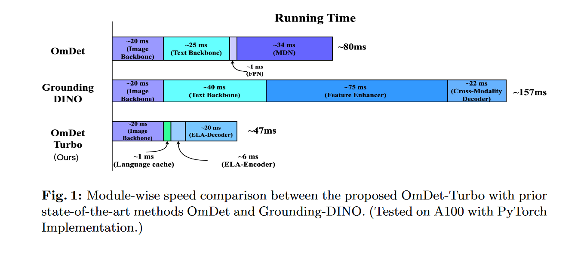
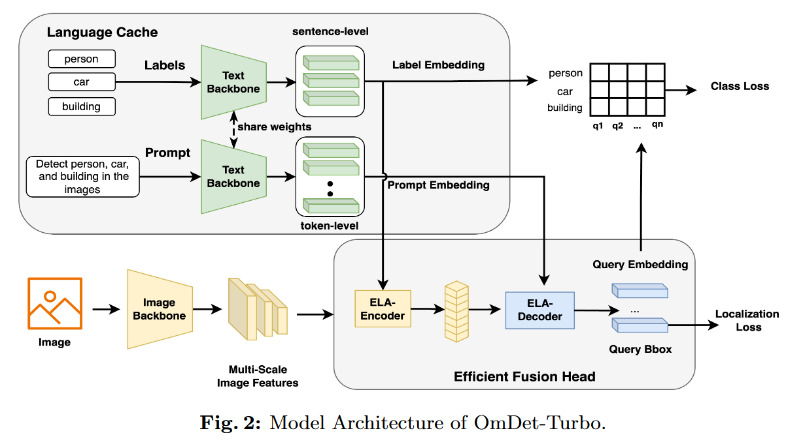
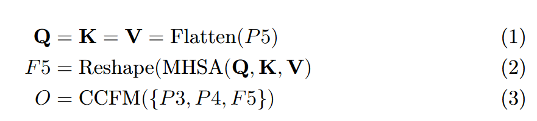
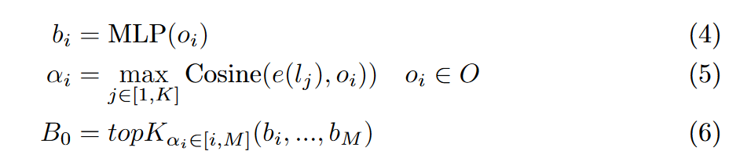
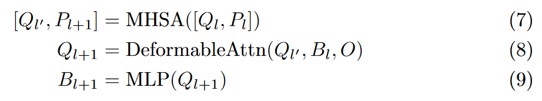
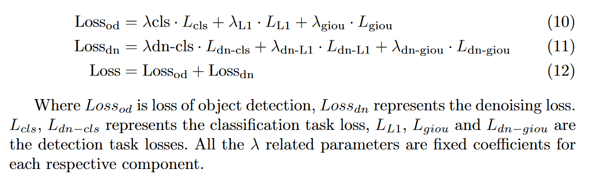
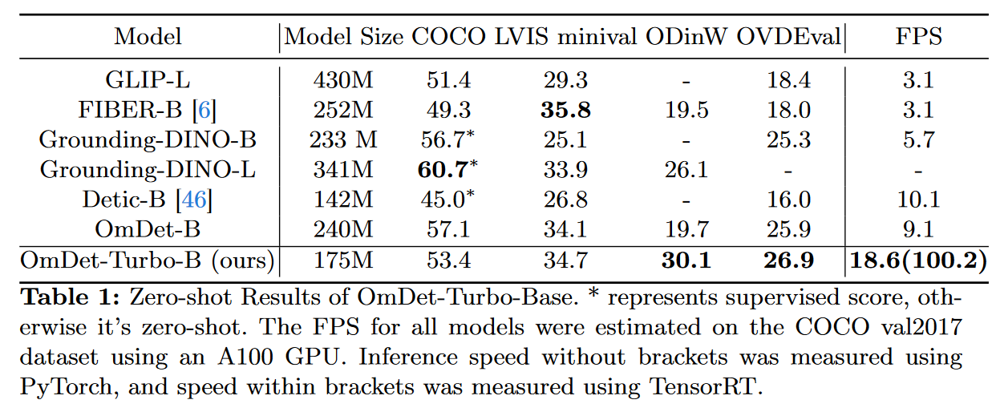
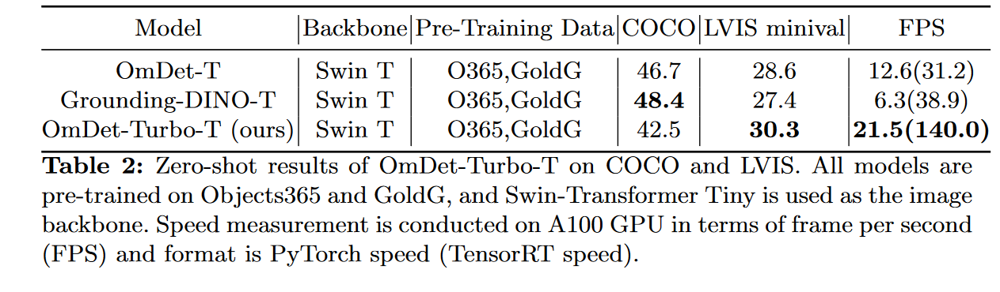
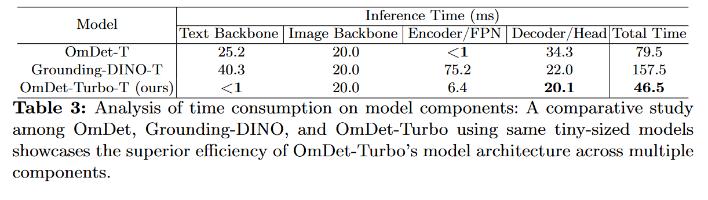

## 文章摘要

通过集成语言模态，基于端到端 transformer 的检测器（DETR）在封闭集和开放词汇目标检测（OVD）任务中表现出了卓越的性能。然而，它们苛刻的计算要求阻碍了它们在实时目标检测（OD）场景中的实际应用。在本文中，我们仔细研究了 OVDEval 基准测试中两个领先模型 OmDet 和 Grounding-DINO 的局限性，并设计了 OmDet-Turbo 模型。这种新颖的基于 transformer 的实时 OVD 模型具有创新的高效融合头 (EFH) 模块，旨在缓解 OmDet 和 Grounding-DINO 中观察到的瓶颈。值得注意的是，OmDet-Turbo-Base 通过应用 TensorRT 和语言缓存技术实现了 100.2 帧/秒 (FPS)。值得注意的是，在 COCO 和 LVIS 数据集上的零样本场景中，OmDet-Turbo 实现的性能水平几乎与当前最先进的监督模型相当。此外，它还为 ODinW 和 OVDEval 建立了新的最先进基准，AP 分别为 30.1，NMS-AP 为 26.86。 OmDet-Turbo 在工业应用中的实用性体现在其在基准数据集上的卓越性能和卓越的推理速度，使其成为实时物体检测任务的一个令人信服的选择。

> 论文链接：https://arxiv.org/abs/2403.06892
> 代码链接：https://github.com/om-ai-lab/OmDet
> 作者单位: 浙江大学

## 主要工作
文章的主要贡献如下：
- 提出了 OmDet-Turbo，一种基于 Transformer 的实时开放词汇检测器，它将强大的 OVD 功能与快速的推理速度结合在一起。该模型解决了开放词汇场景中高效检测的挑战，同时保持高检测性能。

- 推出了 Efficient Fusion Head，这是一种快速多模态融合模块，旨在减轻编码器的计算负担并减少具有 ROI 的头部的时间消耗。该模块在保持卓越的 OVD 性能同时提高效率方面发挥着关键作用。

-  OmDet-Turbo-Base 模型在大规模数据集上进行了训练，展示了出色的零样本检测能力。它在 ODinW 和 OVDEval 数据集上实现了最先进的零样本性能，AP 分数分别为 30.1 和 26.86。此外，OmDetTurbo-Base在COCO val2017数据集上的推理速度在A100 GPU上可以达到100.2 FPS，展示了其高效执行实时开放词汇目标检测任务的能力。

## 论文十问

### 1. 论文试图解决什么问题
该论文想要解决的问题是目前 VLM 大模型的实时推理速度慢的问题。

### 2. 这是否是一个新的问题
该问题其实是一个模型推理效率的问题，大模型为了获取更多的零样本知识往往需要非常大的参数量，这对于实时性的推理非常不利，因此有很多研究者针对这方面进行了努力。类似于闭集目标检测模型，目前推理提速的方法主要是基于两个思路——利用CNN 大改端到端模型结构（比如YOLO-WORLD）和利用小型模块的组合替代部分解码/找框的工作（比如本论文）。

:::tip
**作者认为YOLO-WORLD 利用了CNN 的方法，泛化精度不如 Transformer-Based 的方法。**
:::

### 3. 这篇文章想要验证一个怎样的科学假设
利用自然语言定义的目标类别来识别对象。

### 4. 有哪些相关研究？如何归类？
对于开放世界目标检测（OVD），目前大多数 OVD 模型都是通过将语言模态集成到闭集检测器中来开发的。一些 OVD 模型通过在编码器或颈部组件中执行视觉和语言信息的早期融合来实现模态融合，例如 GLIP。有些利用区域特征和语言特征的对比损失。此外，通过使用大规模图像文本数据以及在训练期间使用更大的视觉主干和文本主干，可以增强模型性能。

文章所关注的是设计一个开放世界对象 proposal 模块。有关这个问题， **GLIP** 提供了一种解决方案，将对象检测重新表述为短语基础问题，从而能够使用基础和大量图像文本配对数据。 **OmDet** 受到 Sparse-RCNN 的启发，将自然语言视为表达知识的统一方式。它有一个专门设计的多模态检测网络（MDN）来解决在使用多个数据集进行训练时手动标签分类合并的问题。后续的 **Grounding DINO** 将基于 Transformer 的检测算法 DINO 与 grounding 任务预训练相结合，支持用户输入带有属性的目标表情，极大地扩展了 OVD 模型的实用性。 **CORA** 试图利用 CLIP 的多模态能力来构建 DETR style 模型。通过利用区域提示，CORA 努力弥合训练数据中整体与区域分布之间的差距。此外，CORA 采用锚点预匹配来解决定位未注释目标的任务。 **BARON** 尝试对齐相关区域集合的区域嵌入，而不是将它们与从 VLM 中提取的相应特征单独对齐。

### 5. 论文中的解决方案关键是什么？

 

本文提出了 **OmDet-Turbo** ，一种基于实时 Transformer 的开放词汇对象检测模型。 **OmDet-Turbo** 利用 DETR 结构来保持简化的端到端设计并实现强大的检测性能。然后，通过仔细检查 **OmDet** 和 **Grounding-DINO** 的结构，我们确定了这些模型的编码器和 **ROIAlign** 模块中的瓶颈。

为了克服这些限制，我们提出了**高效融合头（EFH）**，它显着降低了特征编码和多模态融合的计算复杂度，同时保持良好的泛化能力和检测精度。具体来说，EFH 用高效的语言感知编码器（ELA-Encoder）取代了 DINO 中的重型编码器，该编码器可以在给定来自视觉主干的多尺度特征图的情况下有效地预测与提示相关的查询建议。

此外，我们引入了高效的 **语言感知解码器（ELA-Decoder）**，它简化了视觉语言融合过程，以更少的融合组件实现多任务学习和 OVD 功能。 ELADecoder 首先通过可变形注意机制消除了 OmDet 中对缓慢 ROIAlign 模块的需求，并通过简单的自注意有效地融合了语言和查询的特征。我们还引入了解耦的标签和提示嵌入结构，该结构允许我们缓存文本嵌入以加快推理速度。

通过这些增强功能，OmDet-Turbo 结合了 DETR 强大的检测功能，同时降低了资源密集型模块的计算复杂性，从而实现了适合实际部署的高效检测速度。

具体的设计如下：

 

首先，作者没有把 `prompt` 和 `labels` 使用同一词组（区别于 **GLIP**） 因为作者认为这种方式对于 VQA 问题更加友好（比如可能 `prompt` 会有要求检测出全部对象的），所以作者做了这两者的解耦工作。

对于文本部分的编码，作者对标签使用文本编码器提取的 `cls token` 作为 `sentence-levels label embeddings` ；对于 `prompt embeddings` ，区别于前者，采用的方法是利用 `token-level` 的 `embedding` 维护有关提示的细粒度信息。

:::tip
对于这部分的理解，我的理解是作者对 label 采用了区别于 CLIP 的做法。CLIP 对于每条 prompt，在进入 Text Encoder 前，都会添加表示开始和结束的符号 `[SOS]` 与 `[EOS]`。最终将最后一层 `[EOS]` 位置的向量作为该prompt的特征表示向量。
:::

对于作者设计的 ELA 模块灵感来源于 **RT-DETR**，对于最后一层特征图 `P5` 进行编码获得 `F5` ，然后使用 **RT-DETR** 的 **CCFM** 模块将其融合到 `P4` 和 `P3` 的顶级特征，操作公式如下：

    

**这一步提升了 35% 的速度。**

接下来使用前【top-K】个编码器特征作为解码器中对象位置查询的初始值。（**灵感来源于 DINO**）进行如下操作

    

其中，$b_i$ 是每个图像特征 $o_i$ 的预测边界框，$α_i$ 是基于 **图像特征** 和 **标签嵌入** 之间的余弦相似度的该图像特征的相关性得分。根据相关性得分选择前 【top-K】 个边界框。

解码器部分，区别于 **Grounding DINO** 的利用图像交叉注意和文本交叉注意来融合图像和文本特征的方法, 作者采用的解码层如下：

    

其中 Q 是查询特征，P 是提示特征，O 是来自 ELA-Encoder 的视觉特征，B 是位置框。 Q0 是随机初始化的，P0 从文本主干的 e(p) 中初始化，B0 从 ELA 编码器的 topK 查询中初始化。这个过程通过 Flash Attention 方法进一步加速 MHSA 组件 。此外，在训练过程中，采用 **mask** 来确保查询特征中的去噪查询不会与其他特征（包括文本提示特征）交互。

除了这些，作者也讨论了对于模型的训练，包括多任务学习思路（VQA,HOI 等）、大词汇量数据集下的训练优势、训练方式。

训练采用多个去噪组来加速模型收敛并提高模型精度。与其他 detr-base 模型一致，在重建和预测阶段，采用 L1 损失和 GIOU 损失作为检测任务的主要损失函数。然而，在分类任务中，在对每个查询嵌入与文本特征进行点积后，选择不直接使用focalloss。相反，引入了 IoU-aware Query Selection，这在 RT-DETR 中被证明是有效的，以保持正样本分类和定位之间的一致性。在其他基于 detr 的工作之后，在每个解码器层之后添加了辅助损失。 loss的具体计算公式如下：

    

### 6. 实验如何设计的？
我们还扩大了数据集和词汇量，并预训练了更大的 OmDet-Turbo-Base 模型，以证明我们的模型不仅可以实现更快的推理速度，而且可以利用大量数据获得出色的 OVD 能力。

**预训练：** 采用 ConvNext-Base 作为图像主干，并利用 CLIP ViT-B/16 的文本编码器作为文本主干。为了确保训练期间的稳定性，冻结文本主干的前 6 层，仅微调最后 4 层。在训练过程中，将基础学习率设置为 0.0001，并在总训练步骤的 70% 和 90% 处应用 0.1 的衰减。该模型使用 16 个 NVIDIA A100 GPU 进行训练，批量大小为 64。为了方便 OmDet-Turbo 的实现，我们基于 Detectron2 框架构建模型。

**对比实验：** 对`COCO val 2017` 数据集测试，在常见目标检测 benchmarks 的基础上得到的结果如下

    

在复杂 benchmark 效果如下

    

**消融实验：** Grounding-DINO-T 和 OmDet-T 都提供了利用 Objects365 和 GoldG 的预训练版本，并以 Swin-Transformer Tiny 作为图像主干，因此作者选择了他们作为对比每个部分的运行时间。

    

### 7. 用于定量评估的数据集是什么？代码有没有开源？

作者自己设计了一个数据集：结合 `O365` 进行目标检测，选择 `GoldG` 学习 grounding task，利用 `Hake` 数据集和 `HOIA` 完成人机交互能力，合并 `PhraseCut` 用于短语基础，增强模型内区域和文本之间的对齐。作者将这些数据转换为 VQA 形态进行训练。

评价标准为：COCO、LVIS minival、ODinW、OVDEval

代码已开源

### 8. 论文的实验结果是否支持了其假设？

个人觉得这种比较有点点不公平，因为作者将 text backbone 的缓存没有计入，但是即便如此，也在对比中展现了很好的推理时间。

### 9. 这篇论文有什么贡献？

见文章顶部

### 10. 下一步的深入研究方向和工作？

………………